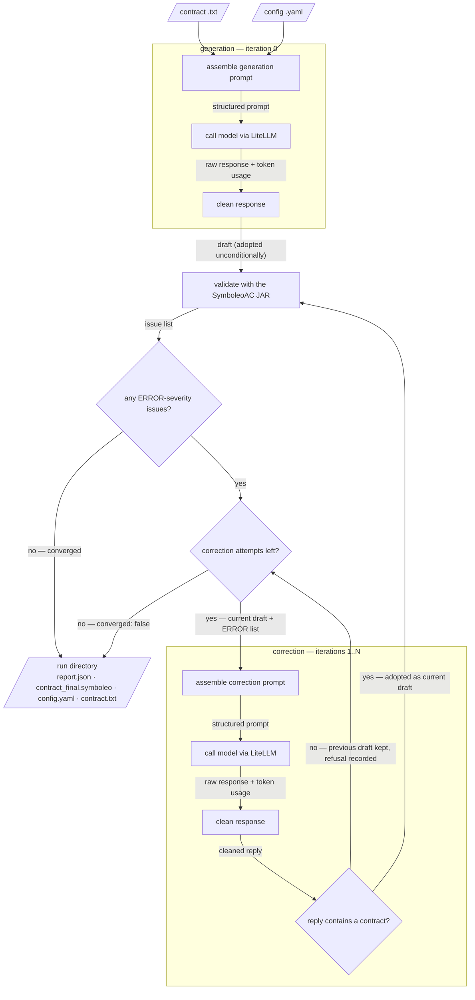

# Architecture

How the Symboleo LLM Tool fits together, for people designing and interpreting
experiments with it. It converts a plain-English contract into
[SymboleoAC](https://github.com/Smart-Contract-Modelling-uOttawa/SymboleoAC-IDE)
— a formal contract-specification language with an access-control layer — by
asking an LLM for a draft and then looping it against the language's real
validator until the output parses clean or the attempt budget runs out.

Three documents serve three needs; this is the middle one:

| You want to… | Read |
|---|---|
| run it — setup, commands, quickstart | [README.md](../README.md) |
| understand it — pipeline, configs, prompts, artifacts | this document |
| change it — conventions, design decisions | [CLAUDE.md](../CLAUDE.md) |

## The pipeline

Before the first LLM call, a run either sets up completely or dies cheaply.
Setup loads the config against a closed schema (an unknown key is a hard
failure, never a silent default), prints advisory warnings for known
model/parameter mismatches, **preflights the Java runtime and the validator
JAR**, constructs both stages' adapters and strategies — for `few_shot` this
eagerly loads every named example — and reads the grammar once if either stage
injects it. The ordering is the point: a broken Java install, a missing
example, or a config typo surfaces *before* any tokens are billed.

The loop itself, per candidate:



Slanted boxes are files on disk, rectangles are pipeline stages, diamonds are
decisions — and **each edge label names the data handed to the next stage**.
Note the single run-directory box: converged and non-converged runs write the
*same* artifact; `converged` is a field inside `report.json`, not a different
output.

Stage by stage:

- **Prompt assembly.** The contract text never reaches a model raw: the
  stage's strategy renders it into a structured, self-contained prompt
  according to the config (which strategy, whether the grammar is included) —
  the full layout is in [Anatomy of a prompt](#anatomy-of-a-prompt).
- **The LiteLLM adapter.** The tool never speaks to a provider SDK directly;
  LiteLLM maps `provider`/`model` onto the right API, which is why any model
  LiteLLM supports is usable. Every call has a wall-clock timeout, and an
  empty provider response is an error, not an empty draft.
- **Response cleaning.** Models wrap code in markdown fences (` ``` ` lines,
  with or without a language tag) and conversational prose ("Here is the
  corrected contract: …"). Cleaning matters because the validator parses top
  to bottom: prose ahead of the code makes it fail at line 1 and **masks every
  real error below** — a run would record a meaningless error state.
  Mechanically: every fence line is dropped wherever it appears (a fence is
  never valid SymboleoAC, even mid-contract), then the text is trimmed to the
  span from the **first** line starting with `Domain` to the **last** line
  containing `endContract`. Two deliberate edge behaviours: a truncated
  contract (no `endContract`) is kept through to the end so the validator
  reports the truncation, and a response with no `Domain` line at all passes
  through fence-stripped for the validator to reject as-is — the cleaner never
  invents a contract. Known limits of the span rule: prose *inside* the span
  survives, and two contracts in one reply merge into one span; both land in
  the validator as errors rather than being silently repaired.
- **Validation.** The bundled SymboleoAC headless CLI — the same parser and
  semantic checks the SymboleoAC IDE runs, so "valid" means valid to the
  language's own toolchain. Issues carry a severity: **ERROR-severity issues
  drive the loop; warnings are recorded in the run report but never sent to
  the correction prompt** (feeding them measurably invited over-editing —
  evidence in CLAUDE.md, *Convergence Semantics*).
- **The adoption gate (correction only).** A correction reply that contains no
  contract at all — a refusal, a garbled echo — is **not adopted**: the loop
  keeps the previous draft and its errors, records the refused text in the
  report, and retries. Without this, one bad reply could destroy an
  almost-correct contract and still report success. Generation is deliberately
  ungated — at iteration 0 there is no previous draft to protect, so a
  degenerate first draft is simply validated and reported as what it is.

Two numbering facts prevent most misreadings of results:

- **Iteration 0 is the generation pass.** Corrections are iterations 1..N, so
  `max_iterations: 3` allows up to **4** LLM calls per candidate, and
  `iterations_used` counts correction passes only — a converged candidate
  showing 0 needed no corrections.
- **A candidate is one independent attempt.** With `num_candidates: 2` the whole
  pipeline above runs twice from scratch; the run succeeds if *any* candidate
  converges.

## Anatomy of a config

A run is fully described by one YAML file.
[`configs/example.yaml`](../configs/example.yaml) is the reference — every
field annotated in place — and this section walks its blocks. Structure is
machine-checked twice: editors with the YAML extension validate against
[`configs/schemas/config.schema.json`](../configs/schemas/config.schema.json) as you type
(generated from the same models the loader uses), and the loader itself
**rejects any unknown key** rather than ignoring it, so a typo like
`temprature` fails the run instead of silently running with a default.

```yaml
pipeline:
  num_candidates: 1
  max_iterations: 5
  stop_on_first_convergence: false
```

The budget block: how many independent attempts, how many corrections each may
use, and whether to keep going after the first success.
`stop_on_first_convergence` trades research data for tokens — the run ends at
the first success instead of completing every candidate.

```yaml
generation:
  llm:
    provider: anthropic
    model: claude-sonnet-4-6
    temperature: 0.2
    max_tokens: 4096
  strategy: zero_shot
  strategy_params: {}
  include_grammar: true
```

**Generation and correction are two independently configured stages** — each
has its own model, temperature, and prompting strategy, so an experiment can,
say, generate with an expensive model and correct with a cheap one. The
`correction:` block has the same shape.

**What may `provider:` and `model:` be?** Anything
[LiteLLM supports](https://docs.litellm.ai/docs/providers) — the tool passes
them through as `provider/model`. The model list in `configs/app/ui_config.yaml` is
only the *web UI's* menu, not a limit on config files. Whether a model name is
real is checked by the provider itself at the first call, which fails fast;
pricing and parameter advisories come from the tool's pinned LiteLLM version,
so a brand-new model runs fine but may show cost as unknown until that
dependency is bumped.

**Strategies** select how the prompt is assembled (detailed in
[Anatomy of a prompt](#anatomy-of-a-prompt) below):

| `strategy` | What it adds |
|---|---|
| `zero_shot` | baseline — task, output rules, and (optionally) the grammar |
| `few_shot` | worked contract→SymboleoAC pairs from `examples/`, chosen by name in `strategy_params.example_files` |
| `cot` | step-by-step reasoning instructions before generating |

For `few_shot`, one rule matters more than any other: **exclude the example
that matches your input contract.** Every shipped example has a matching
`contracts/` file — two pairs are not obvious from the names alone:
`data_processing_agreement` ↔ `Atos.txt` and `transactive_energy` ↔
`Energy.txt`. Including the match shows the model the answer, and the run stops
measuring anything — the shipped `cohere_fewshot.yaml` excludes `meat_sale` for
exactly this reason.

`include_grammar` is a research flag: it gates whether the full SymboleoAC
grammar text is injected into the prompt. Grammar-*derived* guidance (output
rules, reserved names) ships regardless, so the flag isolates the effect of the
grammar text itself.

```yaml
symboleo:
  jar_path: ./lib/symboleo-cli.jar
  java_executable: java
```

Where the validator lives and which `java` runs it.

```yaml
observability:
  langsmith:
    enabled: false
```

Opt-in request tracing to LangSmith; needs an API key in `.env` when enabled.

### Suite configs

A suite runs **one contract against N named configurations** and compares them
— one contract by design, so the contract is the held control variable and the
configs are the treatment. A suite file
([`configs/suite_example.yaml`](../configs/suite_example.yaml), annotated)
names each experiment and gives it a full pipeline config of exactly the shape
above; the contract is supplied on the command line, never in the file.

One suite-level field, `max_concurrency`, caps how many candidates run in
parallel across the whole suite — it cuts wall-clock time, never tokens or
cost (design and limits: [suite-concurrency-design.md](suite-concurrency-design.md)).

## Anatomy of a prompt

Every LLM call in the pipeline — generation and correction alike — is a
**single, self-contained prompt**. There is no conversation: a correction call
does not "remember" the generation call, so everything the model needs is
re-assembled and re-sent each time. The assembly is Jinja2 templates in
[`symboleo_llm_tool/prompts/templates/`](../symboleo_llm_tool/prompts/templates/),
structured after [LangGPT](https://arxiv.org/abs/2402.16929) — prompts as
labeled semantic modules (markdown sections), which empirically reduces model
ambiguity about what each part of the prompt is asking compared to
unstructured prose.

A **generation** prompt, module by module:

```
# Role: SymboleoAC Contract Engineer     ← persona           (_system_header.j2)
## Goals                                 ← the task
## Constraints                           ← behavioural rules: code only, no fences,
                                           no invented placeholder values
## Workflow                              ← CoT strategy only: reasoning steps
## Output Format                         ← the structural reference  (_output_format.j2)
## Reserved Names                        ← grammar-derived word list (_reserved_names.j2)
## SymboleoAC Grammar Reference          ← only when include_grammar (_grammar_section.j2)
## Examples                              ← few_shot strategy only: the chosen pairs
## Input                                 ← the contract text
```

A **correction** prompt keeps the same head — including `few_shot`'s
`## Examples` and CoT's `## Workflow` — but ends differently: `## Current
Contract (contains errors)` holding the draft, then `## Errors to Fix` listing
the validator's ERROR-severity issues verbatim. It deliberately re-includes
`## Output Format` and `## Reserved Names` — statelessness means the
correction call must be re-grounded in the structural rules, not assumed to
recall them.

The three recurring modules carry different kinds of knowledge:

- **`## Output Format`** is the structural reference: the contract skeleton
  (Domain → Contract → Declarations → Obligations → Powers → endContract),
  form rules for constructs the model reliably gets wrong (date arithmetic,
  enumeration references), and *placement* rules — where a well-formed
  construct may legally appear. Its rules are verified against the validator —
  and under the current policy each new rule ships pinned by an integration
  test; a few older bullets predate that policy — because the grammar alone
  does not decide these: much of what the validator enforces lives in Java
  beside the grammar.
- **`## Reserved Names`** lists the words the grammar reserves, derived
  mechanically from the grammar file itself — a model that names a domain type
  `Asset` produces a parse error whose message never names the real problem,
  so prevention beats correction here. It ships in **both** stages regardless
  of `include_grammar`.
- **`## SymboleoAC Grammar Reference`** is the verbatim Xtext grammar plus a
  notation explainer — Xtext is a parser-*generator* notation, and without the
  explainer its meta-notation leaks into output (quoted `'days'`, rule names
  used as constructs). This is the only module `include_grammar` gates, which
  is what makes the flag a clean experiment: grammar-*derived* guidance ships
  either way, so the flag isolates the grammar *text*.

Mechanically, the shared modules are `_`-prefixed partials that every strategy
template includes; a strategy differs only in its own template — `cot` adds
`## Workflow`, `few_shot` adds `## Examples`, `zero_shot` adds neither. The
templates are short and readable directly; the reasoning behind their rules
(and the evidence for it) is in CLAUDE.md's prompt sections.

## Anatomy of a run directory

Every run — CLI or web UI — writes a timestamped directory, the durable
research artifact (the UI's pages are a live view that expires minutes after
completion); if a number matters, it comes from here.

```
output/run_20260804_131453/
├── contract.txt              # the input contract, as submitted
├── contract_final.symboleo   # the final draft (converged, or the last adopted attempt);
│                             # absent when a candidate produced no code at all
├── report.json               # everything below
├── config.yaml               # the config as loaded — rerunning replays the same
│                             #   configuration (generation itself is stochastic)
└── intermediates/            # only with save_intermediates: true —
                              #   iteration_0.symboleo, iteration_1.symboleo, ...
                              #   plus iteration_N_rejected.txt for any refused correction
```

Multi-candidate runs suffix per candidate (`contract_candidate_0_final.symboleo`,
`intermediates_candidate_0/`). Two runs finishing within the same second get
distinct directories — the later one is suffixed (`run_..._2`), never merged
into the first.

`report.json`, top to bottom:

- **Run level** — `success` (did any candidate converge), `input_file`,
  `timestamp`, and rollups: `total_tokens`, `total_cost_usd`,
  `iterations_to_convergence` (from the first converged candidate; `null` if
  none), and `failed_candidate_count` (candidates cut short by a failed
  external call). **`total_cost_usd: null` means unknown** — the pinned
  LiteLLM version had no pricing for the model — never "free".
- **Per candidate** — `converged`, `iterations_used`, `final_code`,
  `final_error_count`/`final_warning_count` (blocking errors and warnings
  lingering in the final draft — they partition its issues by severity),
  `error_history`, and `failure` (`null` unless a failed LLM or validator call
  cut the candidate short, in which case it holds that call's message).
- **Per iteration** (inside `error_history`) — the `code` at that point, every
  validator issue (`severity`, `line`, `column`, `message`), the call's token
  `usage`, and — only when a correction was refused for containing no
  contract — `rejected_response` holding the refused text verbatim.

The error history is the loop's full trace: iteration 0's issues are what the
first draft earned, and each later entry shows what the correction fixed,
introduced, or failed to change.

### Suite output

A suite writes `output/suite_*/` rather than a single run directory: a
suite-level `suite_report.json`, a reloadable `suite.yaml` beside the
`contract.txt` it ran — the pair replays directly as
`symboleo-tool suite contract.txt --config suite.yaml` — a `summary.csv`
comparison (one row per experiment — convergence, iterations, failed
candidates, tokens, cost),
and one subdirectory per experiment in the single-run layout above (minus
`contract.txt` — the suite keeps the one shared copy at the top level).

## What "converged" means — and does not

`converged: true` means exactly one thing: **the final draft has zero
ERROR-severity issues from the SymboleoAC validator** — `final_error_count` is
that count, nonzero exactly on a validated draft that failed. Warnings may
remain (`final_warning_count` shows them); they do not block. A candidate with
`failure` set is `converged: false` even when it shows zero recorded errors —
its draft was cut short before validation, not validated clean.

It does **not** mean the SymboleoAC faithfully models the source contract.
That is a second, separate question. A contract can invent obligations the
text never states, or encode a deadline in an event's *name* rather than an
enforceable predicate, and still validate clean — nothing in `report.json`
can see that. Fidelity is measured separately, analysis-side: an LLM judge
scores each candidate against the contract's curated clause inventory
(`contracts/inventories/`, run via `scripts/fidelity_sweep.py`), reporting
clause coverage and inventions per candidate. Coverage is comparable within
one contract only, never averaged across contracts. The instrument's
calibration, the audit lineage behind it, and the interpretation caveats are
in CLAUDE.md (*Convergence ≠ fidelity*).

## The two interfaces

Both are thin adapters over the same core — a function taking contract text
plus a config and returning the full result — so a CLI run and a UI run with
the same config are the same experiment.

- **CLI** (`symboleo-tool run` / `suite`): commands in the
  [README](../README.md). Prints a summary; the run directory has the rest.
- **Web UI**: configure a run or suite in forms, watch progress live, download
  results. Its Experiment Suite page assembles a suite interactively and can
  **download it as a `suite.yaml`** the CLI reruns headlessly — explore in the
  browser, pin the comparison in version control, rerun on demand. The API
  serving it documents itself at `http://localhost:8000/docs` (generated from
  the code — always current). Jobs in the UI expire minutes after completion;
  the `output/` directory is the archive.

## Failure modes

What happens when a stage does not come back clean:

- **LLM calls are one attempt each.** There are no retries; every call has a
  total wall-clock timeout, and an empty provider response is an error rather
  than an empty draft. The validator subprocess has its own, shorter timeout.
- **A provider or validator error mid-run fails that candidate, not the run** —
  the candidate keeps its completed iterations and their tokens, records the
  message that cut it short in `failure`, and the run completes and writes its
  artifact. Only the tool's own bugs and a failed Java/JAR preflight abort the
  run (CLAUDE.md, *Failed external calls*).
- **A degenerate correction reply is not a failure** — the adoption gate
  refuses it, records it, and retries (see the pipeline stages above).
- **Stopping a run is cooperative.** Cancelling (the UI's Stop, or the API's
  cancel endpoint) takes effect at the next checkpoint — before a candidate
  starts, or between correction iterations. An in-flight LLM call or validator
  run is never interrupted; the cancel lands when it returns.

## Where things live in the code

| Package | Role |
|---|---|
| `symboleo_llm_tool/pipeline/` | the core loop: generate → validate → correct |
| `symboleo_llm_tool/experiments/` | suite orchestration — composes the core per experiment |
| `symboleo_llm_tool/llm/` | LLM access via LiteLLM, plus model-compatibility advisories |
| `symboleo_llm_tool/prompts/` | prompt strategies, Jinja2 templates, the few-shot corpus loader |
| `symboleo_llm_tool/symboleo/` | subprocess wrapper around the validator JAR |
| `symboleo_llm_tool/config/` | the config models and YAML loading |
| `symboleo_llm_tool/output/` | result models, metrics, and the run/suite writers |
| `symboleo_llm_tool/cli/`, `symboleo_llm_tool/api/` | the two entry points |
| `frontend/` | the React web UI |
| `lib/symboleo-cli.jar` | the bundled SymboleoAC validator |

Dependencies point one way: entry points call the pipeline; the pipeline calls
the LLM, prompt, and validator layers; nothing calls back up. Suite logic
*composes* the pipeline rather than modifying it. The reasoning behind these
rules — and everything else deliberate about the design — is in
[CLAUDE.md](../CLAUDE.md); the SymboleoAC language itself is documented in
[symboleo-language-reference.md](symboleo-language-reference.md).
